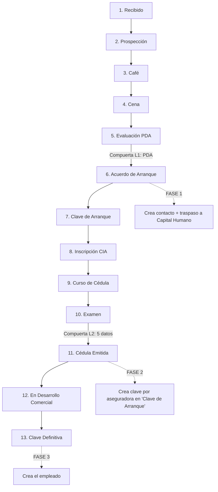

# 📘 Manual de Reclutamiento y Habilitación de Agentes

**Módulo:** `BCA_Seguros` · versión **19.0.1.8.0** · Odoo 19
**Fecha:** 2026-07-16 · **Elaborado por:** Hábitat Digital

> Este documento tiene **dos usos**:
> 1. **Manual del usuario** que se entrega al equipo de Grupo BCA después de la capacitación.
> 2. **Guion de demo** para el sprint review (ver **Anexo A**).
>
> Cubre el proceso **de punta a punta**: desde que se contacta a una persona y entra al
> embudo de reclutamiento, hasta que se completa el ciclo para los **tres tipos** de perfil:
> **Agente**, **Promotor/Promotoría** y **Puesto interno**.

---

## 1. Introducción y alcance

El módulo extiende la aplicación **Reclutamiento** nativa de Odoo para modelar el proceso
comercial de Grupo BCA: captar candidatos, evaluarlos, y — cuando corresponde — **convertirlos
automáticamente** en el contacto y el empleado que la operación necesita, sin recaptura de datos.

**Qué resuelve esta etapa:**
- Un **embudo de 13 etapas** propio del negocio (del primer contacto a la clave definitiva).
- **Compuertas de control** que evitan avanzar sin la información obligatoria (PDA, cédula, RFC/CURP).
- **Conversión automática en 3 fases**: crea el contacto, asienta la clave por aseguradora y
  crea el empleado en el momento correcto del proceso.
- **Traspaso ordenado** de Reclutamiento a Capital Humano.
- Un reporte de seguimiento (**SIC Reclutamiento**).

> **Distinción de servicio (importante).** Hábitat entrega la **arquitectura**: el "cómo" del
> proceso, las reglas, las validaciones y los reportes. La **operación diaria** — capturar
> candidatos, moverlos de etapa, dar seguimiento — la ejecuta el equipo de Grupo BCA. Este
> manual es el "manual de vuelo": el piloto y el combustible los pone BCA.

---

## 2. Glosario rápido

| Término | Qué significa en el sistema |
|---|---|
| **Candidato** | Registro en la app Reclutamiento (`Postulante`). Es el punto de partida de todo. |
| **Reclutadora** | Rol que capta y mueve a *sus* candidatos hasta el Acuerdo de Arranque. |
| **Capital Humano** | Rol que toma la gestión desde el Acuerdo de Arranque hasta el alta del empleado. |
| **Puesto** | El `hr.job` bajo el que se abre el candidato: **Agentes**, **Promotores** o un puesto interno. Define qué reglas aplican. |
| **Agente** | Figura comercial que vende pólizas para una promotoría. Recorre el embudo completo. |
| **Promotor / Promotoría** | Estructura comercial que agrupa agentes. Recorre el embudo, pero termina como *contacto promotoría*. |
| **Puesto interno** | Cualquier puesto administrativo de BCA (RH, contabilidad, etc.). Usa el flujo **nativo** de Odoo. |
| **Sede / Plaza** | Ubicación geográfica del reclutamiento (catálogo de apoyo). |
| **Ramo** | Especialidad del seguro (Vida, GMM, Autos…). |
| **PDA** | Evaluación de perfil del candidato. Genera una **compuerta de riesgo** (L1). |
| **Cédula** | Habilitación oficial del agente ante la aseguradora. |
| **Clave de Arranque** | Primera clave del agente ante una aseguradora. **No** computa producción (PCA). |
| **Clave Definitiva** | Clave firme del agente. Es la que **sí** computa producción (PCA). |
| **Puente (Clave por Aseguradora)** | Registro que liga a un agente con una aseguradora y guarda su clave y su estado. Un agente puede tener varias. |
| **PCA** | Producción de Cartera del Agente (reporte de producción). |
| **SIC Reclutamiento** | Tablero dinámico (pivote) de candidatos por sede, reclutadora, etapa, etc. |

---

## 3. Roles y permisos (quién hace qué)

| Rol | Puede | No puede |
|---|---|---|
| **Reclutadora BCA** | Ver, crear y editar **solo sus** candidatos; moverlos por el embudo hasta *Acuerdo de Arranque*. | Ver candidatos de otras reclutadoras; borrar candidatos. |
| **Capital Humano BCA** | Ver y gestionar **todos** los candidatos; completar habilitación; llegar al alta del empleado. | — (gestión completa del embudo). |
| **Director Comercial BCA** | **Consultar** todos los candidatos y el SIC (solo lectura). | Crear/editar/borrar candidatos. |
| **Director BCA** | **Consultar** todos los candidatos y el SIC (solo lectura). | Crear/editar/borrar candidatos. |

> **Cómo se reparte el proceso:** la **Reclutadora** trabaja el candidato desde el primer
> contacto hasta el **Acuerdo de Arranque**. En ese punto el sistema hace el **traspaso
> automático** a **Capital Humano**, que continúa hasta el alta del empleado. La reclutadora
> queda registrada como *entrevistadora*, para no perder la trazabilidad de quién lo captó.

---

## 4. Dónde vive cada cosa (rutas de menú)

> ⚠️ El reclutamiento **se opera en la app nativa "Reclutamiento" de Odoo**, no dentro del
> menú "BCA Seguros". El menú BCA solo agrega el **reporte** y los **catálogos de apoyo**.

| Elemento | Ruta |
|---|---|
| Embudo de reclutamiento | App **Reclutamiento** (nativa) → puesto **Agentes** o **Promotores** |
| Catálogo de Sedes / Plazas | **BCA Seguros → Configuración → Sedes / Plazas** |
| Aseguradoras | **BCA Seguros → Configuración → Aseguradoras** |
| Promotorías (contactos) | **BCA Seguros → Configuración → Promotorías** |
| Agentes (contactos) | **BCA Seguros → Configuración → Agentes** |
| Reporte de reclutamiento | **BCA Seguros → Reportes → SIC Reclutamiento** |
| Empleados dados de alta | App **Empleados** (nativa) |

> Los menús **Reportes** y **Configuración** están reservados a Líder/Director+ y Director
> Comercial+ respectivamente; una Reclutadora trabaja principalmente en la app Reclutamiento.

---

## 5. Requisitos previos (configuración inicial)

Se hace **una sola vez**, como Administrador, antes de operar:

1. **Puestos comerciales.** El módulo crea automáticamente los puestos **"Agentes"** y
   **"Promotores"**. Son los únicos que activan el embudo comercial y sus reglas.
2. **Catálogo de Sedes / Plazas.** En *Configuración → Sedes / Plazas* vienen sembradas
   *Matriz, Ciudad de México y Monterrey* (placeholder). La lista oficial la entrega BCA.
3. **Aseguradoras.** En *Configuración → Aseguradoras* debe existir al menos una (ej. MetLife).
4. **Usuario de Capital Humano (traspaso).** Hay que indicarle al sistema a qué usuario se le
   reasignan los candidatos en el Acuerdo de Arranque:
   - Ir a **Ajustes → Técnico → Parámetros del sistema** (requiere modo desarrollador).
   - Crear/editar el parámetro **`bca_reclutamiento.capital_humano_user_id`** con el **ID del
     usuario** de Capital Humano.
   - ⚠️ Si este parámetro falta, el candidato **no se reasigna**; el sistema solo deja una nota
     en el historial. El resto del flujo sigue funcionando.

---

## 6. Mapa del proceso

El embudo comercial (idéntico para **Agentes** y **Promotores**) tiene **13 etapas**. Las
**3 fases de conversión** se disparan **automáticamente** al llegar a etapas concretas.

**Cómo se avanza:** arrastrando la tarjeta del candidato entre columnas en el **kanban**, o
cambiando la etapa en la **barra de estado** del formulario. **No hay botones especiales**: la
automatización ocurre sola al cruzar cada etapa clave.

| Fase | Se dispara al llegar a… | Qué hace | Aplica a |
|---|---|---|---|
| **Fase 1** | **6. Acuerdo de Arranque** | Crea el **contacto** (agente o promotoría) y **traspasa** el candidato a Capital Humano | Agentes y Promotores |
| **Fase 2** | **11. Cédula Emitida** | Crea la **clave por aseguradora** en estado *Clave de Arranque* | Solo Agentes |
| **Fase 3** | **13. Clave Definitiva** | Crea el **empleado** | Solo Agentes |

---

## 7. Procedimiento paso a paso — AGENTE (caso completo)

Es el flujo principal y el que recorre las 3 fases. *Rol que inicia:* **Reclutadora**.

### 7.1 Contacto y alta del candidato
1. App **Reclutamiento** → puesto **Agentes** → botón **Nuevo**.
2. Captura el **nombre del candidato** y la **Promotoría destino** (obligatoria para agente).
3. Elige la **Sede / Plaza**. Guarda. El candidato nace en la etapa **1. Recibido**.

### 7.2 Captura del perfil (pestañas del formulario)
- **Identificación** → *Datos personales* (Género, Fecha de Nacimiento, **Edad** — se calcula
  sola, no se edita) e *Identidad (Id interno PCA)*: **RFC** y **CURP**.
- **Detalles** (nativa) → grupo *Perfil BCA*: **Ramo** y **Perfil Laboral**. El **Grado**
  académico y el **origen** del candidato (Fuente/Medio/Campaña) usan los campos nativos.
- **Evaluación PDA** → *Resultado PDA* (Nivel, Correlación, Perfil).
- **Habilitación** → se llena más adelante (cédula y claves).

### 7.3 Compuerta L1 — Evaluación PDA
- Al poner un **Nivel PDA de riesgo** (*No Ideal* / *Baja Compatibilidad*), el sistema marca
  solo **PDA en Riesgo** y muestra el campo **Visto Bueno del Promotor**.
- 🔒 **Bloqueo:** no podrás mover el candidato más allá de *Evaluación PDA* mientras haya
  riesgo y **falte** el visto bueno. Marca **Visto Bueno del Promotor** para desbloquear.

### 7.4 FASE 1 — Acuerdo de Arranque (crea contacto + traspaso)
1. Mueve el candidato a la etapa **6. Acuerdo de Arranque**.
2. Para agente, el sistema **exige**: **Promotoría destino, Sede, RFC y CURP**. Si falta
   alguno, se bloquea con un mensaje indicando qué capturar.
3. **Qué pasa automáticamente:**
   - Se crea el **contacto Agente** (visible en *Configuración → Agentes*), colgando de su
     **Promotoría destino**. El RFC va a *NIF/VAT* y el CURP a su campo propio.
   - El candidato se **reasigna a Capital Humano**; la reclutadora queda como *entrevistadora*.
   - Queda una nota en el historial del candidato.

> A partir de aquí, la gestión la continúa **Capital Humano**.

### 7.5 Habilitación (Curso, Examen y captura de cédula)
Conforme el agente avanza (Inscripción CIA → Curso de Cédula → Examen), Capital Humano llena la
pestaña **Habilitación**:
- **Aseguradora**, **Clave de Arranque**, **Fecha de Cédula** (y opcionalmente Clave Definitiva).

### 7.6 Compuerta L2 — datos obligatorios de cédula
🔒 **Bloqueo:** no se puede llegar a **11. Cédula Emitida** sin los **5 datos**:
**Clave de Arranque, Fecha de Cédula, Aseguradora, RFC, CURP**. El sistema indica cuáles faltan.
> El **formato** de RFC y CURP también se valida (deben tener el patrón mexicano correcto).

### 7.7 FASE 2 — Cédula Emitida (crea la clave por aseguradora)
1. Mueve el candidato a **11. Cédula Emitida**.
2. **Qué pasa automáticamente:**
   - Se crea la **Clave por Aseguradora** (el "puente") en estado **Clave de Arranque**
     (nunca *Clave Definitiva* en esta fase).
   - Se generan **actividades** de aviso para reclutadora y promotor.
   - En *Configuración → Agentes*, el agente muestra una **línea** en *Claves por Aseguradora*.
> ⚠️ **Todavía NO existe empleado** en este punto, y el botón *Create Employee* aún no aparece.

### 7.8 FASE 3 — Clave Definitiva (crea el empleado)
1. En **Habilitación**, captura la **Clave Definitiva**.
2. Mueve el candidato a **13. Clave Definitiva**.
   - 🔒 Si intentas llegar sin capturar la Clave Definitiva, se bloquea pidiéndola.
3. **Qué pasa automáticamente:** se crea el **empleado** (app Empleados), vinculado al contacto
   agente.

> **Regla clave de negocio (D-14):** llegar a *Clave Definitiva* **crea el empleado**, pero
> **NO** cambia el estado del puente a *Clave Definitiva* — ese cambio es un **proceso interno
> posterior**, fuera de esta etapa. Por eso un agente recién habilitado (en *Clave de Arranque*)
> **no computa PCA**: la producción solo la contabilizan las claves en estado *Clave Definitiva*.

---

## 8. Procedimiento — PROMOTOR / PROMOTORÍA

Recorre el **mismo embudo** que un agente, pero termina como **contacto Promotoría**.

1. App **Reclutamiento** → puesto **Promotores** → **Nuevo**.
2. Captura el candidato y muévelo por el embudo (aplica la compuerta **L1 de PDA**).
3. **FASE 1 — Acuerdo de Arranque:** se crea automáticamente el **contacto Promotoría** bajo el
   holding **Grupo BCA**, y ocurre el traspaso a Capital Humano.
4. **Diferencias respecto al agente:**
   - **No** aplica la compuerta L2 (los 5 datos de cédula).
   - **No** se ejecutan la Fase 2 (clave por aseguradora) ni la Fase 3 (empleado).

> En resumen: para promotor, el resultado del embudo es **el contacto Promotoría**.

---

## 9. Procedimiento — PUESTO INTERNO

Para vacantes administrativas de BCA (RH, contabilidad, etc.), que **no** son figuras comerciales.

1. Estos puestos **no vienen sembrados**: créalos como cualquier `hr.job` en Odoo (ej.
   "Auxiliar administrativa").
2. Abre el candidato bajo ese puesto. **Usa el embudo NATIVO de Odoo**, no las 13 etapas BCA.
3. **Qué NO aplica:** no se piden Sede/Promotoría/RFC/CURP, no hay compuertas L1/L2, no se crea
   contacto agente ni clave por aseguradora.
4. **Alta del empleado:** al llegar a la etapa final nativa (**Contract Signed**), se usa el
   **botón manual "Create Employee"** de Odoo. **No** es automático.

> **Nota (BUG-017):** la antigua etapa "Contratado (Alta Interna)" fue **retirada**. Los puestos
> internos siguen el estándar de Odoo; el módulo BCA no interviene su flujo.

---

## 10. Reporte SIC Reclutamiento

**Ruta:** **BCA Seguros → Reportes → SIC Reclutamiento**.

- Es una **tabla dinámica (pivote)**: por defecto muestra **candidatos por Sede (filas) y
  Etapa (columnas)**.
- Puedes **agrupar** por Sede, Reclutadora, Puesto, Ramo, Campaña/Evento y Etapa.
- Cambia a vista **Gráfica** (barras) desde los íconos de vista.
- **Búsqueda:** por nombre del candidato, puesto, sede, reclutadora o campaña.

> Sirve como tablero de control de la Dirección para ver el embudo en tiempo real.

---

## 11. Preguntas frecuentes / errores comunes

| Situación / mensaje | Causa | Solución |
|---|---|---|
| No me deja pasar de *Evaluación PDA* | PDA en riesgo sin visto bueno (Compuerta L1) | Marca **Visto Bueno del Promotor** en la pestaña *Evaluación PDA*. |
| No me deja llegar a *Cédula Emitida* | Faltan datos de habilitación (Compuerta L2) | Llena los **5 datos** en *Habilitación*: Clave de Arranque, Fecha de Cédula, Aseguradora, RFC, CURP. |
| Error de formato en RFC/CURP | El valor no cumple el patrón mexicano | Corrige el RFC/CURP con el formato correcto. |
| No me deja llegar a *Clave Definitiva* | Falta la Clave Definitiva | Captúrala en *Habilitación* antes de mover la etapa. |
| El candidato no se reasignó a Capital Humano | Falta el parámetro de sistema | Configura `bca_reclutamiento.capital_humano_user_id` (ver §5.4). |
| Creé dos candidatos de la misma persona | Idempotencia por RFC+CURP | El sistema **no duplica** el agente; le suma una **línea de clave** por cada aseguradora. |
| El agente no aparece en PCA | Está en *Clave de Arranque* | Es correcto: solo *Clave Definitiva* computa PCA (proceso interno posterior). |
| No veo los candidatos de mis compañeras | Regla de visibilidad de Reclutadora | Es correcto: cada reclutadora ve solo los suyos. Capital Humano/Dirección ven todo. |

---

## Anexo A — Guion de demo (Sprint Review)

**Objetivo:** demostrar en vivo el flujo completo y las reglas de negocio entregadas en este
desarrollo. **Duración estimada:** 20–25 min. **Usuario:** Administrador (o Capital Humano).

### Preparación (antes de la sesión)
- [ ] Confirmar módulo **BCA_Seguros 19.0.1.8.0** instalado; modo desarrollador activo.
- [ ] Verificar aseguradora (ej. *MetLife*) y una **Promotoría** de prueba bajo Grupo BCA.
- [ ] Confirmar el parámetro `bca_reclutamiento.capital_humano_user_id`.
- [ ] Tener a la mano datos de prueba: RFC `PEJJ900101ABC`, CURP `PEJJ900101HDFXXX01`,
      Clave Arranque `DEMO-CLV-001`, Clave Definitiva `DEMO-DEF-001`.

### Escenas

| # | Escena | Qué mostrar | Fase / regla que evidencia |
|---|---|---|---|
| 1 | **Configuración** | Sedes/Plazas, Aseguradoras, puestos *Agentes* y *Promotores* | Fase A — cimientos |
| 2 | **Alta de candidato agente** | Crear en puesto *Agentes*; Promotoría destino + Sede; pestañas Identificación / Detalles / PDA / Habilitación | HU de captura; embudo de 13 etapas |
| 3 | **Compuerta L1 (PDA)** | Poner PDA "Baja Compatibilidad" → intentar avanzar → **bloqueo** → marcar Visto Bueno → avanza | Compuerta de riesgo L1 |
| 4 | **FASE 1 — Acuerdo de Arranque** | Mover a *Acuerdo de Arranque* → se crea el **contacto Agente** + **traspaso a Capital Humano** (mostrar el cambio de responsable y la nota) | Fase 1 (D-21) |
| 5 | **Compuerta L2** | Intentar llegar a *Cédula Emitida* sin datos → **bloqueo** con lista de faltantes → llenar los 5 datos | Compuerta L2 + formato RFC/CURP |
| 6 | **FASE 2 — Cédula Emitida** | Mover a *Cédula Emitida* → aparece la **clave por aseguradora en "Clave de Arranque"**; **aún no hay empleado** | Fase 2 (D-14) |
| 7 | **FASE 3 — Clave Definitiva** | Capturar Clave Definitiva → mover a *Clave Definitiva* → se crea el **empleado** | Fase 3 (D-21) |
| 8 | **PCA no computa arranque** | Abrir *Reportes → PCA por Agente*: el agente en Clave de Arranque **no** produce | Regla de negocio D-14/SI-4 |
| 9 | **Idempotencia** | Segundo candidato con mismo RFC/CURP y otra aseguradora → **no duplica** agente, suma línea de clave | D-15 |
| 10 | **Promotor** | Crear candidato en *Promotores* → en *Acuerdo de Arranque* se crea el **contacto Promotoría** (sin Fase 2/3) | Diferencia por tipo |
| 11 | **Puesto interno** | Crear puesto interno y candidato → **embudo nativo** + botón manual *Create Employee* | BUG-017 |
| 12 | **SIC Reclutamiento** | Abrir el pivote; agrupar por Sede/Etapa; cambiar a Gráfica | Reporte de seguimiento |
| 13 | **Visibilidad por rol** | Entrar como Reclutadora (ve solo lo suyo) vs Director (ve todo, solo lectura) | Seguridad por rol |

### Cierre
Resumir el valor: **captura una vez, convierte solo, controla el avance con compuertas y
mide con el SIC** — sin recaptura y con trazabilidad de quién captó a cada agente.

---

## Anexo B — Notas de decisiones (el "porqué"), en lenguaje llano

| Decisión | Qué significa para el negocio |
|---|---|
| **D-14** | El agente nace en **Clave de Arranque** y **no** computa producción hasta tener Clave Definitiva. Promover a definitiva es un proceso interno posterior. |
| **D-15** | La identidad del agente es **RFC + CURP**; por eso la misma persona **nunca se duplica**, aunque venga por dos candidaturas o dos aseguradoras. |
| **D-17** | La lógica pesada (crear contactos/empleados) ocurre al **cambiar de etapa**; las notas de aviso son solo informativas. |
| **D-20** | El **embudo comercial** es exclusivo de *Agentes* y *Promotores*; los **puestos internos** usan el flujo nativo de Odoo. |
| **D-21** | La conversión se reparte en **3 fases** (Acuerdo → contacto; Cédula → clave; Clave Definitiva → empleado), con **traspaso a Capital Humano** en el Acuerdo de Arranque. |
| **BUG-017** | Aclaración: los puestos internos **no** generan agentes, ni claves, ni etapas BCA; se dan de alta con el botón manual nativo. |

---

## Control de versiones del documento

| Versión | Fecha | Autor | Cambios |
|---|---|---|---|
| 1.0 | 2026-07-16 | Hábitat Digital | Versión inicial para capacitación + sprint review (módulo 19.0.1.8.0). |
